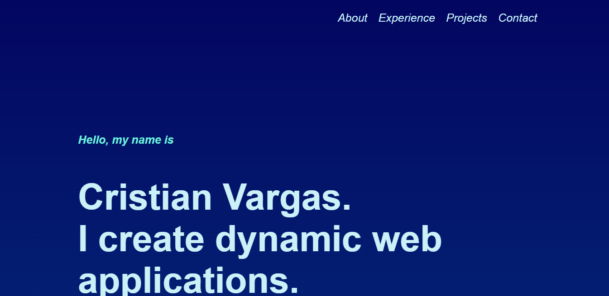

# Portfolio Demo

For this assignment, I took advantage of using all of what we have learned about HTML, CSS, Javascript, and API's to create a colorful and user friendly portfolio. I have included information about myself, my experience, current projects, and how to get in touch with me. Projects and other information may change during the course of the Full Stack Bootcamp.

# Github Links
[Github Pages](https://vcristian1.github.io/portfolio-demo/)
[Repository](https://github.com/vcristian1/portfolio-demo)

# Screenshot 

